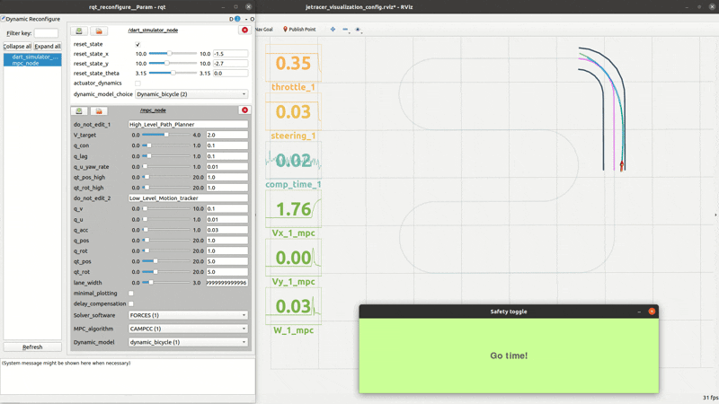

# curvature_aware_mpcc_pkg
Curvature-Aware Model Predictive Contouring Control based on the following paper:

[link to paper](https://ieeexplore.ieee.org/abstract/document/10161177)

[Youtube video](https://www.youtube.com/watch?v=6-E3I99D2sc)


## Installation
*Clone this repo*

This repo is a ROS package, to use it as an MPC controller first clone this repo in a [catkin workspace](http://wiki.ros.org/catkin/Tutorials/create_a_workspace).

```
git clone https://github.com/Lorenzo-Lyons/curvature_aware_mpcc_pkg.git
```

You will then need to build the package and re-source the workspace.

*Install vehicle dynamic model*

This repo is intended to work as an MPC controller for a 1:20 scaled down car-like robot developed in the Cognitive Robotics department in Delft university of technology called DART (Delft's Autonomous-driving Robotic Testbed). This repository uses the dynamic models available in the DART git repo, please follow the instructions there on how to install the dynamic model's python package.

[DART paper](https://ieeexplore.ieee.org/document/10588526)

[DART git repo](https://github.com/Lorenzo-Lyons/DART)

*Build the MPC solvers*

This repo requires the solvers used by the controller to be built in advance. To do so you will need a running installation of [acados](https://docs.acados.org/). We additionally provide the [forcespro](https://forces.embotech.com/documentation/introduction/index.html) version of the low-level controller, if you are planning to use it follow the steps on their webpage to set up. 

Then navigate to *curvature_aware_mpcc_pkg/src/MPC_generate_solvers* and run the files named *build_solvers_**. Note that more options for the same solver are available, e.g. the *build_solvers_ACADOS_high_level.py* has the option to build the CAMPCC or the MPCC version of the lane following mpc. All the options need to be pre-build. Do so by specifing the all the options inside the file.

## Running the CA-MPCC controller
With a roscore running launch the dart simulator with no visualization (we will use the visualization from this repo instead).

```
roslaunch dart_simulator_pkg dart_simulator_no_visuals.launch
```
now launch the visualization from this repo

```
roslaunch curvature_aware_mpcc_pkg rviz_visualization.launch 
```

now launch the controller

```
roslaunch curvature_aware_mpcc_pkg mpc_controller.launch 
```

Now select the deisred MPC options from the GUI, select the pygame "safety window" and press the spacebar.

<div align="center">
  
</div>

## Known issues
The ACADOS version of the high level CA-MPCC algorithm and the ACADOS version of the low level dynamic bicycle model solvers do not work well for high speeds.


