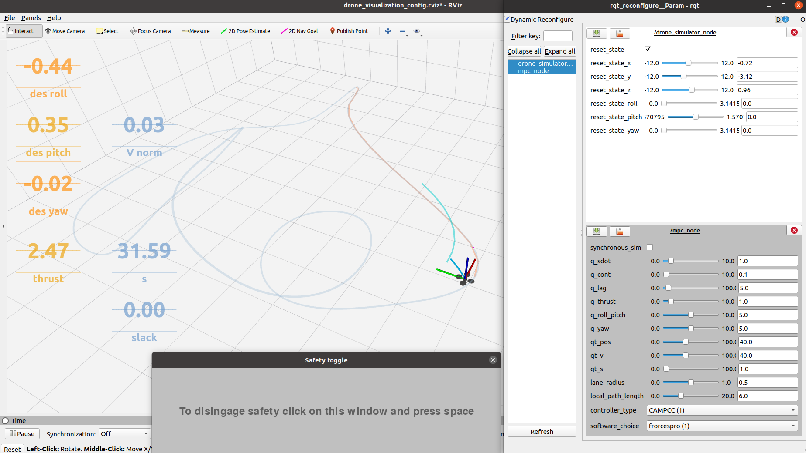

## Curvature-Aware MPCC for drone racing (rCA-MPCC)


## Installation
1. Create a catkin workspace. This is just a folder named as you like, and add a subfolder called src inside it.
2. Open the src folder in a terminal and clone only this branch.

```
git clone -b drone_racing --single-branch https://github.com/Lorenzo-Lyons/curvature_aware_mpcc_pkg.git
```
This shold be your finial structure.
```
catkin_ws/
└── src/
└── curvature_aware_mpcc_pkg/
```


## running the code
1. Build the catkin workspace and source it.
2. Re-build the solvers. Go to src/solvers_setup/1_build_solvers.py and re build the desired solvers.
```
catkin_ws/
└── src/
└── curvature_aware_mpcc_pkg/
└── src/
└── solvers_setup/
└── 1_build_solvers.py
```
4. Launch the drone simulator. Open a terminal and execute:
```
roslaunch curvature_aware_mpcc_pkg rviz_simulation.launch
```
4.Launch the mpc controller. In another terminal:
```
roslaunch curvature_aware_mpcc_pkg mpc_node.launch
```
